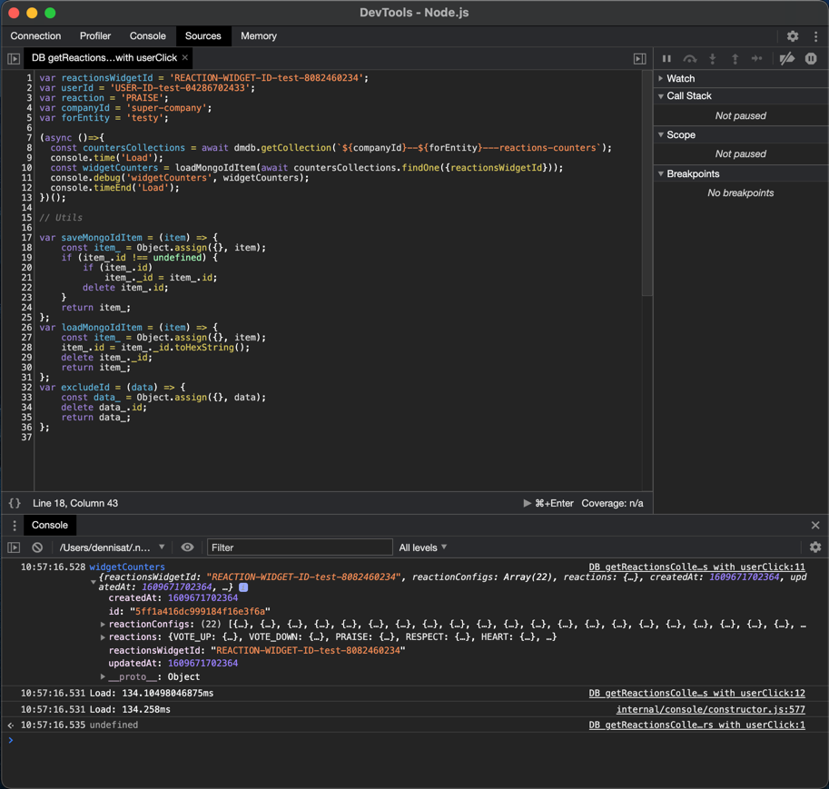

# Dyna Mongo DB

- Simplifies the connection
- Simpler find methods
- Optional database or collection level upgrade (aka migration)

Also, this repo offers a friendly playground alternative to MongoDb's shell.

# Upgrade mechanism (aka Database migration)

Dyna Mongo DB offers a database Upgrade (aka migration) mechanism, with versions and Upgrade Methods (instead of SQL scripts). Through the Upgrade Methods (callbacks) you can access the Mongo DB's instance and perform the Upgrade.

Additionally, Dyna Mongo DB offers the same upgrade mechanism per Collection. Collections can have their Upgrades. This way, you don't need to upgrade the database but only the Collections.

Read the [Upgrade mechanism](README.Upgrade.md) for more.  

# Dynamic Collections

We can also have dynamic collections with Upgrades. Imagine the Collection `users` that has its own Upgrades Methods. 
If you create a Collection with the name `tesla---users`, then the Dyna Mongo DB will create this Collection and run the Upgrade Methods of the `users` Collection.

The magic happened because the `---` (three dashes) indicate the dynamic collections.

This way, the `tesla---users` Collection has the same features as the `users` Collection. 

Now you can create different `users` collections per project/customer/organization or any other entity in the same database making the Collections super fast and maintainable.

Another use case would be the invoices, you can split them per company and year:

For example:
- `tesla-2020---invoices`
- `google-2020---invoices`
- `beacon-2020---invoices`

# Methods

## Constructor

The constructor expects this config object as an argument.
```
interface IDynaMongoDBConfig {
  connectionString: string;
  databaseName: string;
}
```
- `connectionString`: The db connection string for applications is something like this `mongodb+srv://user:<password>@bui-cluster0.tyydp.mongodb.net/<dbname>?retryWrites=true&w=majority`
- `databaseName`: The name of the database

Usage:

```
const dmdb = new DynaMongoDB({connectionString: '<my mongodb connection string>', databaseName: 'happy-cars-production'})
const docs = await dmdb.find({collectionName: 'tesla---users', filter: { userId 4952 } })
```

## Connection methods

### connect(): Promise<Db>

Connects to the database and returns the Mongo DB instance. If it is already connected, it returns the Mongo DB instance.

> You don't need to connect to use the rest methods. Dyna Mongo DB is getting connected automatically.

### getDb(): Promise<Db>

Precisely the same as connect().

> You don't need to connect to use the rest methods. Dyna Mongo DB is getting connected automatically.

### disconnect(): Promise<void>

It just disconnects the database.

> If you use any of the methods, it will reconnect automatically. Use the `disconnect()` when the app (or a test) will shut down.

## Collection methods

You can get the collection instances from Mongo's DB instance (by `getDb()`, for example). To automatically upgrade the collections and keep them up to date, always use the Dyna Mondo DB methods.

### createCollection<TSchema>(collectionName: string): Promise<Collection<TSchema>>

It creates the Collection and runs the needed upgrades (if any). It returns the MongoDB's Collection instance.

### getCollection<TSchema>(collectionName: string): Promise<Collection<TSchema>>

It gets (or creates) the Collection and runs the needed upgrades (if any). It returns the MongoDB's Collection instance.

### dropCollection(collectionName: string): Promise<boolean>

It removes the Collection and cleans up the upgrade info for the dropped Collection.

> Never do `const db = await dmdb.getDb(); db.dropCollection('my-collection')`, since the saved upgrade info will produce errors for this collection, after this you will use it !

### getCollectionNames(): Promise<string[]>

It returns the existing collection names.

### collectionExists(collectionName: string): Promise<boolean>

Returns a boolean if a collection exists.

### getCollectionVersion(collectionName: string): Promise<number>

Returns the Upgrade version of the Collection. -2 is for Collections that don't have an Upgrade applied.

## Find methods

The find methods simplify the way to `find` something in the database. You don't have to connect to the database either. After the Dyna Mongo DB instantiation, you can call the method even for a Collection that doesn't exist.

What it is doing under the hood:
- connects to database
- gets the Collection
- if the Collection doesn't exist, it creates it
- runs the Upgrades if needed
- performs the find operation

> Don't worry, it is super fast!

### findFirst()

```
findFirst<TSchema>(args: {
  collectionName: string;
  filter?: FilterQuery<TSchema>;
  sort?: SortOptionObject<TSchema>;
}): Promise<TSchema | null> {
```

Returns the first document or null if no matching.

Example:

```
const doc = await dmdb.find(collectionName: 'my-collection', filter: {id: 3}, sort: {name: 1});
```

This is equivalent with this:

```
const collection = await dmdb.getCollection('my-collection');
const doc = await collection.find({id: 3}).limit(1).sort({name: 1}).toArray();
```

### find()

```
find<TSchema>(args: {
  collectionName: string;
  filter?: FilterQuery<TSchema>;
  sort?: SortOptionObject<TSchema>;
  limit?: number;
}): Promise<TSchema[] | null> {
```

Returns an array of documents or an empty array.

Example:
```
const doc = await dmdb.find({collectionName: 'my-collection', filter: {userId: 4952}, sort: {name: 1} })
```

This is equivalent with this:

```
const collection = await dmdb.getCollection('my-collection');
const doc = await collection.find({id: 3}).sort({name: 1}).toArray();
```

or with this

```
const db = await dmdb.getDb();
const collection = await db.collection('my-collection').find({id: 3}).sort({name: 1}).toArray();
```

### explain()

Has the same parameters as the `find` but return an `explain` object.

```
find<TSchema>(args: {
  collectionName: string;
  filter?: FilterQuery<TSchema>;
  sort?: SortOptionObject<TSchema>;
  limit?: number;
}): Promise<IDynaMongoDBExplain> {
```

Return this explanation object.

```
interface IDynaMongoDBExplain {
  mongoDBExplain: CursorResult;     // The mongoDb explain object
  usedIndex?: string;               // The used index for this find
  usedIndexName?: string;           // The used index name for this find
}
```

## Upgrade methods

## addCollectionsUpgrades(collectionsUpgrades: ICollectionsUpgrades): void

Add Collections Upgrades dynamically. This method offers to add collections (or update) after the initialization of the DynaMongoDB.

## upgradeDatabase(): Promise<IUpgradeCollectionResults>

Upgrade the database. This executes the upgrades of the `upgradeDatabase` config property.

_You don't need to call this, this is called automatically on first use of db. You may need this if you want to know if the upgrades are success before you use the db._

## upgradeCollection(collectionName: string): Promise<IUpgradeCollectionResults>

Upgrade a collection. This executes the upgrades of this specific collection.

_You don't need to call this, this is called automatically on first use of this collection. You may need this if you want to know if the upgrades are success before you use this collection._

# Utils

This package comes with a small amount of _optional_ utils.

## Save Load Docs (with id)

Mongo DB has for all documents the `_id: ObjectId` property. We can use this `_id: ObjectId` as `id: string` using the these functions:

`import {saveDoc, loadDoc} from "dyna-mongo-db"`

### saveDoc = <TData, >(item: TData): any

It converts a data object with the `id: string` property replacing it with `_id: ObjectId` with the same id value.

Example:
`const counters = await counters.updateOne(saveDoc(counter));`

### loadDoc = <TData, >(item: TData): TData

It converts a data object with the `_id: ObjectId` property replacing it with `id: string` with the same id value.

Example:
`const counters = loadDoc(await counters.findOne({widgetId}));`

## $setData

It creates the value for the `$set` by an object.

Example:
```
await users.updateMany(
  {
    userId,
  },
  {
    $set: {
      updatedAt: now,
      ...$setData('phones', phones),
    },
  },
);

```
# Tests setup of this repo

Create the file `tests/setup/testConnectionInfo.ts`. There is a sample of it `tests/setup/testConnectionInfo.ts`.

Inside assign the connection string of a demo database. It is safe to use it on production dbs also.

# Debug playground

## About the playground

This is an alternative to MongoDb's shell but intended for developers.

This playground is useful because what you will write to test is the actual code you will use in the end.

The responses (the promised one) are precisely what your code will get.

So for development, it is faster to work with this playground instead of MongoDb's shell. 

## Setup

Create the file `tests/setup/testConnectionInfo.ts`. There is a sample of it `tests/setup/testConnectionInfo.ts` and assign there the connection string of a demo database. It is safe to use it on production dbs also.

## Start it 

- clone this repo
- `yarn`
- `yarn debug-dev-build` _and_
- `yarn debug-dev-devtools-brk` _in parallel_
- Open Chrome's browser debugger (devTools)
- On top right there is (now) the Node's icon, click it
- The debugging of the `debug-dev-devtools-brk` instance starts
- Press the "play" button (on the Sources tab) to resume the script's execution
- Open the console, and you will have the ``dmdb`` available

## Play with it

An example of creating a collection

```
dmdb.createCollection('my-collection').then(c=>{collection=c; console.info('collection created')}).catch(console.error);
```

When the promise is fulfilled, you will get the console.info, and the Collection will be available or get the console.error.

You can also get a collection instance like this with a closure.

```
(async () => { collection = await dmdb.getCollection('my-collection');})()
```


Next, you can add something to this Collection.

```
collection.insertOne({info:'My 1st doc'}).then(()=>console.info('done')).catch(console.error)
```

Similarly, you can do everything with collections working with real code!

